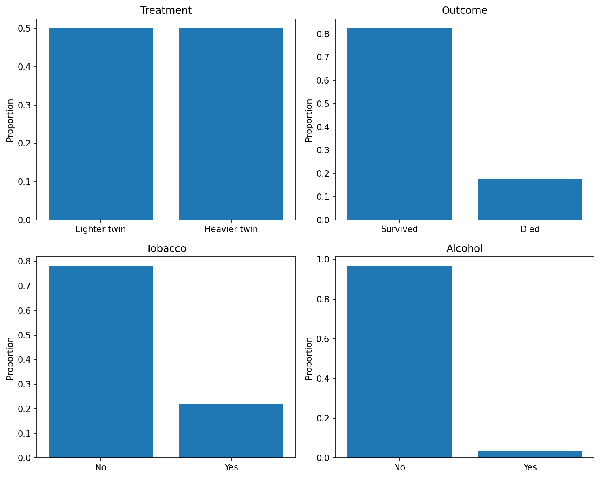
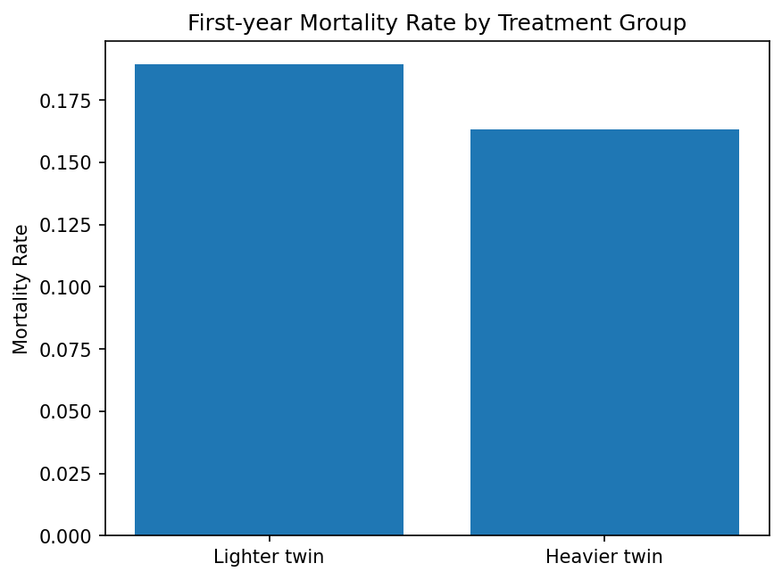
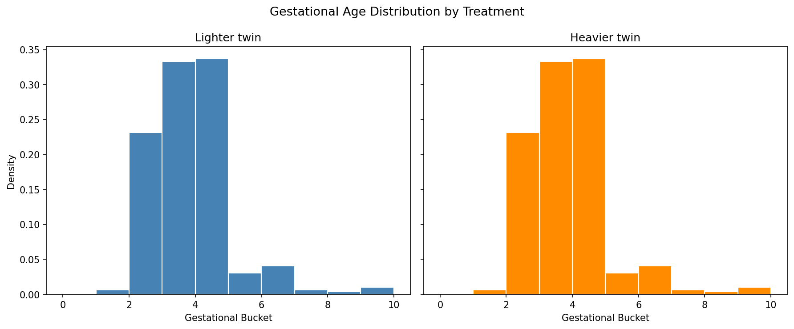
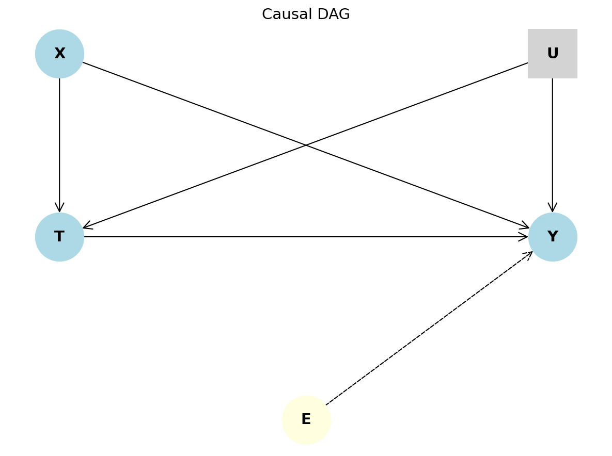
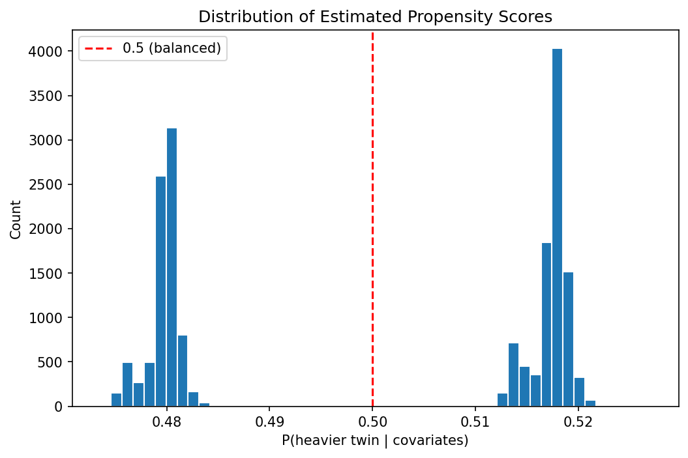
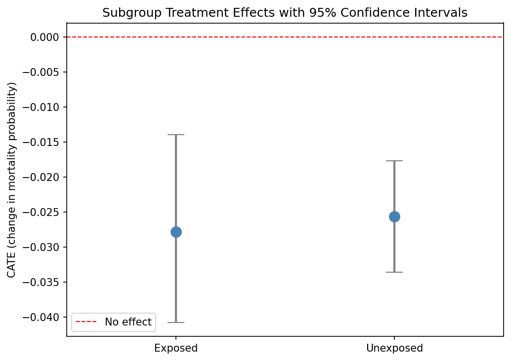

# Causal Analysis of the Twin Birth Weight Effect

## 1. Causal Question and Motivation

### 1.1 Causal Question

This project investigates two related causal questions. First, what is the average effect of being born the heavier twin on first-year mortality among same-sex twins under 2kg? Second, does this effect differ for infants whose mothers used tobacco or alcohol during pregnancy?

### 1.2 Motivation

Low birth weight is a well-established risk factor for infant mortality, particularly among premature births. Understanding whether a weight advantage exists can lead to improvements in clinical practice and hospital preparedness, particularly in neonatal care settings managing high-risk twin births. Determining this average effect is the first objective of this analysis.  

The second objective is to investigate whether this causal effect varies by maternal prenatal substance exposure. Tobacco and alcohol use during pregnancy are known teratogens with adverse effects on fetal development. If the mortality benefit of being the heavier twin is attenuated among exposed infants, this would suggest that substance exposure undermines the protective role of relative birth weight, with direct implications for clinical interpretation of birth weight in high-risk twin pairs. If the effect is amplified in the exposed group, that would be an unexpected finding warranting further investigation. Capturing this potential heterogeneity motivates the use of a meta-learner approach alongside the average treatment effect estimate.

### 1.3 Dataset and Context

This analysis uses the Twins dataset originally studied by Louizos et al., obtained via the DoWhy library's reference implementation. The data used for analysis is filtered to same-sex twin pairs where both twins weigh under 2kg at birth. This results in approximately 24,000 individual twin observations across roughly 12,000 pairs. Each row represents a single twin and includes 46 maternal, paternal, and birth-related covariates spanning demographics, maternal health conditions, prenatal care, and birth circumstances.  

The treatment indicator equals 1 if the twin was the heavier of the pair and 0 otherwise. The outcome is a binary indicator for first-year mortality. Tobacco and alcohol exposure are recorded at the maternal level and used to define the subgroup of interest for the heterogeneity analysis. The within-pair structure of the data is particularly well suited to this causal question because twins share their mother, gestational environment, and genetics, allowing the lighter twin to serve as a near-natural control for the heavier twin.

### 1.4 Roadmap

The report proceeds as follows:

1. Exploratory Data Analysis describes the dataset, key variables, and preprocessing steps
2. Causal Identification and Estimation formalizes assumptions and implements the Doubly Robust estimator and T-Learner
3. Results and Comparative Analysis reports estimated effects and method comparison
4. Evaluation conducts refutation tests and sensitivity analysis
5. Conclusion and Future Work synthesizes findings and discusses limitations
6. Link to the Code Repository

## 2. Exploratory Data Analysis

### 2.1 Data Source

The dataset is obtained from the DoWhy library's reference implementation of the Twins example. The data is sourced from the Counterfactual VAE repository associated with Louizos et al. It is constructed from U.S. birth and infant death records and filtered to same-sex twin pairs where both twins weigh under 2kg at birth. The data is also reshaped so that each row represents a single twin. The resulting dataset contains 23,968 individual twin observations across 11,984 pairs.

### 2.2 Variable Description
The raw dataset contains 46 covariates in addition to the treatment and outcome. Table 1 summarizes the variables grouped by their role in the analysis. The treatment is a binary indicator equal to 1 if the twin was the heavier of the pair. The outcome is a binary indicator for first-year mortality. Gestational age (gestat10) was originally identified as the primary confounder in the analysis plan, as it influences both birth weight and mortality risk. As discussed in Section 2.4, the within-pair structure of the data complicates this role. Tobacco and alcohol exposure are recorded at the maternal level and used to define the subgroup of interest for the heterogeneity analysis. The remaining covariates capture maternal and paternal demographics, maternal health conditions and complications during pregnancy, prenatal care, birth circumstances, and geographic identifiers.

Table 1. Description of variables used in the analysis.

| variable                                                                                                                                                           | role                | type        | description                                                                                                              |
|:-------------------------------------------------------------------------------------------------------------------------------------------------------------------|:--------------------|:------------|:-------------------------------------------------------------------------------------------------------------------------|
| treatment                                                                                                                                                          | Treatment           | Binary      | 1 if heavier twin in the pair, 0 if lighter                                                                              |
| outcome                                                                                                                                                            | Outcome             | Binary      | 1 if death in first year, 0 otherwise                                                                                    |
| gestat10                                                                                                                                                           | Confounder          | Ordinal     | The number of gestational weeks prior to birth binned into 10 ordered categories (higher = longer gestation)             |
| tobacco, alcohol                                                                                                                                                   | Exposure (subgroup) | Binary      | Maternal prenatal substance use during pregnancy. Combined into a single 'any exposure' indicator for subgroup analysis. |
| Maternal demographics (mager8, mrace, meduc6, dmar, mplbir, ormoth)                                                                                                | Covariate           | Mixed       | Mother's age, race, education, marital status, place of birth, and origin                                                |
| Paternal demographics (orfath, frace, feduc6, dfageq)                                                                                                              | Covariate           | Mixed       | Father's age, race, education, and origin                                                                                |
| Maternal health conditions (anemia, cardiac, lung, diabetes, herpes, hydra, hemo, chyper, phyper, eclamp, incervix, pre4000, preterm, renal, rh, uterine, othermr) | Covariate           | Binary      | Health condition indicators and complications during pregnancy                                                           |
| Prenatal care (mpre5, adequacy, nprevistq)                                                                                                                         | Covariate           | Mixed       | Month prenatal care began, adequacy of care, and number of prenatal visits                                               |
| Birth circumstances (pldel, birattnd, birmon, csex, crace)                                                                                                         | Covariate           | Mixed       | Place of delivery, birth attendant, month of birth, infant sex, and race                                                 |
| Geographic (brstate, stoccfipb, brstate_reg, stoccfipb_reg, mplbir_reg)                                                                                            | Covariate           | Categorical | State and regional identifiers                                                                                           |
| Substance use intensity (cigar6, drink5)                                                                                                                           | Covariate           | Ordinal     | Cigarettes per day and drinks per week                                                                                   |
| Infant variables (infant_id, bord, dlivord_min, dtotord_min)                                                                                                       | Covariate           | Mixed       | Infant identifier, birth order, and birth order minimums                                                                 |
| Other (data_year)                                                                                                                                                  | Covariate           | Integer     | Year of birth record                                                                                                     |

*Variables later excluded during preprocessing (paternal demographics and high-cardinality geographic identifiers) are documented in Section 2.3.*

### 2.3 Preprocessing

Several preprocessing steps were applied to prepare the data for analysis. Each is documented below with its justification.

**Removal of pairs with missing exposure.** Twin pairs with missing values for either the tobacco or alcohol exposure variable were removed. Missingness in these maternal variables was structural at the pair level: when one twin had a missing exposure value, their sibling did as well, since both twins share their mother. This allowed clean removal of affected pairs without splitting the within-pair structure. Imputation was rejected for these variables because the subgroup analysis depends critically on accurate exposure status, and imputed values would risk introducing artifacts into the heterogeneity estimates. This step removed 6,280 rows (3,140 pairs), leaving 17,688 individual twin observations across 8,844 pairs.

**Construction of the combined exposure indicator.** A combined exposure indicator (any_exposure) was constructed, equal to 1 if the mother used tobacco, alcohol, or both during pregnancy. This was chosen over analyzing the substances separately for two reasons: prenatal tobacco and alcohol are both established teratogens with overlapping mechanisms of harm, supporting their treatment as a single exposure category; and alcohol exposure alone was rare (3.6% of the analytic sample), making separate subgroup estimation underpowered. After construction, 4,050 observations (~23%) were exposed and 13,638 were unexposed.

**Exclusion of non-covariate columns.** The following columns were excluded from the covariate set used for modeling: the unique identifier (infant_id); birth weight (wt), which defines the treatment and therefore cannot serve as a confounder; the treatment and outcome variables themselves; and the derived any_exposure indicator, which is reserved for defining subgroups in the heterogeneity analysis.

**Removal of paternal variables.** Four paternal variables (orfath, frace, dfageq, feduc6) were dropped due to severe missingness (25 to 28 percent of records). These variables were judged to be lower-priority confounders, as the analysis centers on maternal characteristics and pregnancy conditions, which are the more proximate determinants of fetal outcomes given that the mother carries both twins.

**Reduction of high-cardinality geographic variables.** Three high-cardinality state-level identifiers (brstate, stoccfipb, mplbir, each with roughly 50 distinct values) were dropped in favor of their regional aggregates (brstate_reg, stoccfipb_reg, mplbir_reg, each with 9 values), which are already present in the data. This limits the dimensionality of the design matrix after one-hot encoding. The decision is further supported by the within-pair structure: both twins share the same geographic location, so geography cannot differentially affect which twin becomes heavier and acts at most as an outcome predictor rather than a within-pair confounder.

**Imputation of remaining missing values.** After the above steps, remaining missing values in the covariate set were imputed. Ordinal variables (such as cigar6, drink5, dlivord_min, dtotord_min, adequacy, nprevistq, mpre5, mager8) were imputed using the median, preserving their natural ordering. Nominal and binary variables (such as the maternal health condition flags, pldel, birattnd, and the regional identifiers) were imputed using the most frequent value. A more rigorous approach that adds explicit missingness indicators is noted as a direction for future work.

**Encoding of categorical variables.** Nominal categorical variables stored as integer codes were one-hot encoded prior to modeling, so that the models treat them as unordered categories rather than ordered numeric values. Ordinal variables were retained in their numeric form to preserve ordering.

### 2.4 Descriptive Findings

Figure 1 shows the marginal distributions of the four key binary variables in the analytic sample. Treatment is mechanically balanced at 50% by construction, since each pair contributes one heavier twin and one lighter twin observation. The first-year mortality rate is 17.6%, reflecting the high-risk population of twins born under 2kg.

**Figure 1.** Distribution of key binary variables in the analytic sample (N = 17,688 twins, 8,844 pairs). Treatment is balanced 50/50 by construction. First-year mortality is 17.6%. Tobacco exposure is recorded for 22.2% of mothers, while alcohol exposure is rare at 3.6%. The disparity in exposure prevalence motivates combining both into a single any exposure indicator for the subgroup analysis.

Figure 2 presents the unadjusted comparison of mortality rates between heavier and lighter twins. Lighter twins die at 18.9%, while heavier twins die at 16.3%, a naive difference of 2.6 percentage points favoring the heavier twin. This unadjusted estimate motivates the causal methods in Sections 3 and 4, which adjust for covariates to isolate the effect of being the heavier twin from confounding influences.

**Figure 2.** First-year mortality by treatment group. Lighter twins die at 18.9% versus 16.3% for heavier twins, a naive difference of 2.6 percentage points. This unadjusted estimate motivates the causal methods in Sections 3 and 4, which adjust for confounding to isolate the effect of being the heavier twin.

Figure 3 examines covariate balance on gestational age (gestat10), originally identified as the primary confounder in the analysis plan. The two distributions are nearly identical because both twins in a pair share their mother's gestation, so maternal variables are marginally balanced across treatment groups by construction. This pairing structure is an important feature of the data: confounding from maternal variables that are shared by both twins cannot operate marginally, and instead any residual confounding must come from infant level variables that differ within a pair (such as birth order). This finding does not eliminate the need for adjustment, since the causal methods condition on the full covariate set and benefit from including any variables that drive the outcome. However, it reframes the interpretation of the methodology: rather than primarily correcting for marginal maternal confounding, the adjustment captures within pair variation in infant level characteristics.

**Figure 3.** Distribution of gestational age (gestat10) by treatment group. The two distributions are nearly identical because both twins in a pair share their mother's gestation, so maternal variables are marginally balanced across treatment groups by construction. This pairing structure means that confounding in this dataset operates primarily through infant level variables rather than maternal ones, motivating the use of full covariate adjustment in the causal estimation that follows.

## 3. Causal Identification and Estimation

### 3.1 Identification Assumptions

Three assumptions are required to interpret the estimates in this analysis as causal effects rather than statistical associations: 

1. the Stable Unit Treatment Value Assumption (SUTVA)
2. the Conditional Independence Assumption (CIA)
3. Positivity

Each is stated and justified below in the context of the twins data.

#### Stable Unit Treatment Value Assumption (SUTVA)
SUTVA requires two conditions: no interference between units, and a well-defined treatment with no hidden versions. No interference holds across twin pairs in this dataset, as each pair is biologically independent of every other. Within a pair there is mechanical interdependence (the two twins compete for in-utero resources), but the treatment is defined at the within-pair level, so this is handled by the design rather than violating the assumption. Consistency holds straightforwardly, as the treatment is operationally defined: a twin's treatment status is determined by whether their birth weight is greater than their pair's other twin.

#### Conditional Independence Assumption (CIA)
CIA requires that, conditional on the observed covariates, treatment assignment is independent of the potential outcomes. Formally, (Y(0), Y(1)) ⊥ T | X. For this assumption to hold in the twins data, the observed covariates must capture all variables that simultaneously influence (a) which twin in a pair becomes heavier and (b) the first-year mortality outcome. The analysis adjusts for a rich set of maternal, prenatal, and infant level covariates, providing substantial control for measurable confounders. However, the within-pair determinants of relative birth weight are not fully observed. Factors such as in-utero positioning, placental sharing dynamics, and subtle congenital growth differences are not captured in the data and could plausibly drive both treatment status and mortality. CIA is therefore likely violated to some degree, which is addressed in Section 5 through a formal sensitivity analysis for unobserved confounding.

#### Positivity (Common Support)
Positivity requires that for every covariate profile present in the data, there is a non-zero probability of being treated and of being untreated. Formally, 0 < P(T = 1 | X) < 1. This assumption is unusually strong in the twins dataset. Because each pair contributes exactly one heavier twin (T=1) and one lighter twin (T=0), every covariate profile defined by maternal variables (which are shared within a pair) automatically has both treated and untreated observations. The only edge case that could violate positivity is a pair in which both twins have identical birth weights, leaving the treatment undefined. A check of the analytic sample found zero such tied pairs across all 8,844 pairs. Positivity therefore holds by design for maternal covariates and is empirically verified across the full sample.

### 3.2 Causal Graph

Figure 4 presents the assumed causal structure relating the treatment, outcome, observed covariates, unobserved confounders, and the subgroup effect modifier.

**Figure 4.** Causal graph for the analysis. T is the treatment (being the heavier twin), and Y is the outcome (first-year mortality). X represents the observed covariates, spanning maternal, prenatal, and infant level variables. Arrows from X to both T and Y reflect that the covariate set is treated as a potential source of confounding for adjustment purposes, though within this dataset the within-pair structure means most maternal covariates do not drive treatment assignment marginally. U represents unobserved confounders such as in-utero positioning and placental sharing dynamics, which are believed to influence both which twin becomes heavier and mortality outcomes. The square shape for U distinguishes it as unobserved, while circular nodes represent observed variables. E is the any-exposure indicator that defines the subgroup for the heterogeneity analysis. The dashed arrow from E to Y represents effect modification: the magnitude of the T to Y effect is hypothesized to differ between the exposed and unexposed subgroups.

### 3.3 Causal Methods

Two causal inference methods are used in this analysis: the Doubly Robust estimator to estimate the average treatment effect, and the T-Learner meta-learner to estimate heterogeneous treatment effects across the maternal substance exposure subgroup. Each is described below.

#### 3.3.1 Doubly Robust Estimator (ATE)

The average treatment effect is estimated using the Doubly Robust (DR) estimator, specifically the Augmented Inverse Propensity Weighting (AIPW) form. The estimator combines two models: a propensity model, which estimates each twin's probability of being the heavier twin given covariates, and an outcome model, which predicts first-year mortality given covariates and treatment status. Both are fit as logistic regressions, appropriate for the binary treatment and binary outcome.

The defining property of the DR estimator is that it is consistent if either the propensity model or the outcome model is correctly specified, not necessarily both. This provides two independent chances at recovering the true effect and makes the estimator robust to misspecification of either component. The AIPW estimate is computed as the difference between the augmented mean outcomes under treatment and control:

ATE = mean[ T(Y − μ₁)/e(X) + μ₁ ] − mean[ (1−T)(Y − μ₀)/(1−e(X)) + μ₀ ]

where e(X) is the estimated propensity score, and μ₁ and μ₀ are the outcome model's predicted mortality probabilities with treatment set to 1 and 0 respectively for every observation.

Because the two twins in a pair are not independent observations (they share a mother, gestational environment, and most covariates), standard confidence intervals that assume independence would understate uncertainty. To address this, confidence intervals are computed using a cluster bootstrap that resamples whole twin pairs with replacement rather than individual twins. This preserves the within-pair correlation structure and yields honest interval estimates. The reported interval is the 2.5th to 97.5th percentile of 500 bootstrap estimates.

#### 3.3.2 T-Learner for CATE

In order to determine whether the protective benefit of being the heavier twin differs between infants with and without prenatal substance exposure, a T-Learner was used to estimate the conditional average treatment effect (CATE). The T-Learner builds two predictive models that are then used to determine the CATE. One model is trained on the treated units and predicts mortality from the covariates, while the other is trained on the control units and predicts mortality from the covariates. A prediction is made from both models for every individual, and the difference is calculated for each person. Once the difference has been calculated for every individual, these individual differences are averaged within each subgroup to obtain the subgroup-level CATE, rather than only an individual-level estimate. A logistic regression learner was used because the outcome is a binary variable; the predictions are between survival and death, so logistic regression is appropriate rather than linear regression. Logistic regression also maintains consistency with the Doubly Robust estimator and avoids overfitting in the relatively small exposed subgroup. To quantify uncertainty, 95% confidence intervals for each subgroup CATE and for the difference between them were computed using a cluster bootstrap. Whole twin pairs were resampled with replacement and the T-Learner was refit on each resample, preserving the within-pair correlation structure and yielding valid intervals.

## 4. Results and Comparative Analysis

### 4.1 Average Treatment Effect Estimates

The average treatment effect was estimated using four methods. Table 2 presents the point estimates and, for the doubly robust estimator, the 95% confidence interval.

**Table 2.** Average treatment effect estimates across methods.

| Method | ATE Estimate | 95% CI |
|:---|:---|:---|
| Naive (unadjusted) | -0.0261 | — |
| Regression-adjusted | -0.0263 | — |
| Doubly Robust (AIPW) | -0.0262 | [-0.0329, -0.0189] |
| DoWhy IPW (cross-check) | -0.0263 | — |

Four methods were used to estimate the average treatment effect: naive, regression-adjusted, doubly robust, and DoWhy IPW. All four produced a similar result of around -2.6 percentage points (-0.0261, -0.0263, -0.0262, and -0.0263). Each method relies on different assumptions and mechanisms, yet all converged on the same estimate. Because these methods have different potential failure modes, their agreement indicates that no single method's assumptions are driving the result, and that the estimate is robust to the choice of method. The near-identity of the naive and adjusted estimates is itself informative: it reflects the within-pair design, in which maternal confounders are shared between twins and therefore cannot bias the marginal comparison. This was anticipated in the exploratory analysis and is confirmed by the propensity score diagnostics (Figure 5), where scores cluster tightly around 0.5, indicating the covariates carry little information about treatment assignment. A 95% confidence interval was computed for the doubly robust estimator, resulting in [-0.0329, -0.0189], which excludes zero. This indicates the protective effect of being the heavier twin is statistically significant.

**Figure 5.** Distribution of estimated propensity scores, P(heavier twin | covariates). All scores cluster tightly around 0.5, confirming that positivity is satisfied and inverse-probability weights are well-behaved. The narrow spread reflects the within-pair design, in which shared maternal covariates carry little information about treatment assignment.

### 4.2 Conditional Average Treatment Effect Estimates

The T-Learner was used to estimate the conditional average treatment effect within the exposed and unexposed subgroups. Table 3 presents the subgroup estimates and their 95% confidence intervals, along with the difference between them.

**Table 3.** Subgroup conditional average treatment effects.

| Subgroup | CATE | 95% CI |
|:---|:---|:---|
| Exposed | -0.0278 | [-0.0407, -0.0140] |
| Unexposed | -0.0256 | [-0.0336, -0.0177] |
| Difference (exposed − unexposed) | -0.0021 | [-0.0176, +0.0145] |

The T-Learner estimated a protective effect of -2.8 percentage points among exposed infants and -2.6 percentage points among unexposed infants. Both subgroup confidence intervals exclude zero, so the protective effect of being the heavier twin is statistically significant within each subgroup. The difference between the two subgroups, however, was small (-0.2 percentage points) with a 95% confidence interval of [-0.0176, +0.0145] that includes zero. Because this interval includes zero, there is no statistically detectable evidence that prenatal substance exposure modifies the protective effect of being the heavier twin. This should not be interpreted as proof that no difference exists, only that the analysis cannot distinguish the difference from zero.

It is worth noting that the two subgroup effects are each individually distinguishable from zero, yet their difference is not distinguishable from zero. This occurs because the uncertainty in the difference combines the uncertainty of both estimates, which is large relative to the small observed gap between them. The point estimate leans slightly toward a larger effect in the exposed group, which is the opposite of the attenuation that was hypothesized, but this difference is well within the range of noise and should not be interpreted as a real effect. This null finding should be interpreted in light of the modest size of the exposed subgroup (approximately 4,050 observations), which limits the statistical power to detect modest heterogeneity.

**Figure 6.** Subgroup conditional average treatment effects with 95% confidence intervals. Both the exposed and unexposed subgroups show a statistically significant protective effect of being the heavier twin, as both intervals fall entirely below zero. However, the two intervals overlap substantially, illustrating why the difference between subgroups is not statistically significant. The wider interval for the exposed subgroup reflects its smaller sample size (approximately 4,050 observations versus 13,638), which limits precision and statistical power to detect heterogeneity.

### 4.3 Reconciling ATE and CATE

Based on the results from the ATE and the CATE subgroups, it is concluded that being the heavier twin is protective. The overall ATE of -2.6 percentage points is consistent with the two subgroup CATEs of -2.8 percentage points for exposed and -2.6 percentage points for unexposed infants. Additionally, the average of the individual treatment effects from the T-Learner, -2.6 percentage points, matches the doubly robust average treatment effect. The CATE analysis extends the ATE by examining whether the effect varies across the exposure subgroups. Based on the results, no heterogeneity was detected, meaning the single ATE is an adequate summary of the effect across both subgroups. The agreement between two distinct methods, the doubly robust estimator and the T-Learner, further strengthens confidence in the overall finding.

## 5. Evaluation

Because the Twins dataset does not contain a known ground truth effect, the validity of the estimates was assessed through refutation tests and a sensitivity analysis rather than direct comparison to a true value.

### 5.1 Refutation Tests

Three of DoWhy's refutation tests were applied to the doubly robust estimate. Table 4 summarizes the results.

**Table 4.** Refutation test results.

| Test | Description | New Effect | p-value | Result |
|:---|:---|:---|:---|:---|
| Placebo treatment | Replace treatment with random noise | +0.0029 | 0.22 | Pass |
| Random common cause | Add a random confounder | -0.0263 | — | Pass |
| Data subset | Re-estimate on 80% subsets | -0.0275 | 0.35 | Pass |

Since the Twins data does not contain a ground truth effect, robustness was assessed using DoWhy's refutation tests, which check whether the estimate behaves as a valid causal estimate should under specific perturbations of the data. Replacing the treatment with random noise resulted in an estimated effect of 0.003. With a p-value of 0.22, this effect is statistically indistinguishable from zero, confirming that the original estimate reflects a genuine treatment-outcome relationship rather than spurious structure. When a randomly generated confounder was added, the estimate remained unchanged at -0.0263, supporting robustness to random covariates; the p-value is undefined here because the estimate showed zero variance across simulations, a consequence of its complete stability. Finally, re-estimating on a random 80% subset produced an almost identical effect of -0.0275, with a p-value of 0.35, confirming the result is not driven by any specific subset of observations. While these tests demonstrate the estimate is robust, it is important to note that they cannot confirm the unconfoundedness assumption. To address this, a sensitivity analysis was conducted.

### 5.2 Sensitivity Analysis

A sensitivity analysis was conducted to assess how strong an unobserved confounder would need to be in order to overturn the estimate. A simulated unobserved confounder was introduced with varying levels of association to both the treatment and the outcome. At the weakest level tested, 1% association with each, the estimate remained essentially unchanged at -0.0265. However, at 5% association with both treatment and outcome, the effect was driven nearly to zero (-0.0002). These results indicate the estimate is moderately robust: a confounder of roughly 5% association strength on each side would be sufficient to nullify the effect. The within-pair design narrows the space of plausible confounders. Because maternal confounders are shared between twins and therefore cannot operate within a pair, any such unobserved confounder would have to act at the infant level, for example through differences in in-utero positioning or unequal placental sharing. A confounder of this strength cannot be ruled out, and it represents the primary threat to the causal interpretation of this analysis.

## 6. Conclusion and Future Work

### 6.1 Summary of Findings

The findings of this analysis support that being the heavier twin reduces first-year mortality by approximately 2.6 percentage points. This effect is statistically significant, with a 95% confidence interval of [-0.0329, -0.0189], and it is robust across four estimation methods and three refutation tests. No statistically detectable evidence was found that prenatal substance exposure modifies this effect; both subgroups showed a significant protective effect of similar magnitude. The sensitivity analysis indicated the result is moderately robust, as an unobserved confounder of roughly 5% association strength with both treatment and outcome would be sufficient to overturn it.

### 6.2 Limitations

Several limitations qualify the interpretation of these results.

1. **Unobserved confounding.** The conditional independence assumption cannot be verified, and the sensitivity analysis showed that an unobserved confounder of moderate strength (roughly 5% association with both treatment and outcome) would be sufficient to nullify the estimated effect. Plausible infant-level confounders such as in-utero positioning and unequal placental sharing are not captured in the data. This is the primary threat to the causal interpretation.

2. **Limited statistical power in the exposed subgroup.** The exposed subgroup contained approximately 4,050 observations, which limits the power to detect modest effect modification. The absence of detectable heterogeneity may therefore reflect insufficient power rather than a true absence of effect modification.

3. **Self-reported exposure.** Maternal tobacco and alcohol use are self-reported and are likely under-reported, which may introduce misclassification into the subgroup definitions and attenuate any true difference between exposed and unexposed infants.

4. **Simple imputation.** Missing covariate values were imputed using the median for ordinal variables and the most frequent value for nominal variables, without explicit missingness indicators. This approach is straightforward but could introduce minor bias if missingness is informative.

5. **Excluded variables.** Paternal variables and high-cardinality geographic identifiers were excluded from the adjustment set. While these exclusions were justified by missingness, dimensionality, and the within-pair structure, it remains possible that some excluded variables carried residual confounding information.

### 6.3 Future Work

Several extensions could strengthen or expand this analysis.

1. **Flexible base learners.** The T-Learner used logistic regression as its base learner. Re-running the analysis with flexible models such as gradient boosting could capture nonlinear heterogeneity that logistic regression may not detect.

2. **Missingness indicators.** A more rigorous treatment of missing data would add explicit missingness indicator variables alongside imputation, allowing the models to use the fact that a value was missing as potentially informative.

3. **Separate substance analysis.** With a larger exposed subgroup or additional data, tobacco and alcohol exposure could be analyzed separately rather than combined, isolating the contribution of each substance.

4. **Additional CATE estimators.** Applying alternative meta-learners such as the X-Learner, or a Double Machine Learning approach, would provide a cross-check on the heterogeneity findings from the T-Learner.

5. **Explicit pair-level modeling.** The within-pair correlation was addressed through a cluster bootstrap. A complementary approach would model the pairing directly, for example through conditional logistic regression or fixed-effects models, which could improve efficiency and provide an additional robustness check.

## 7. Repository Link